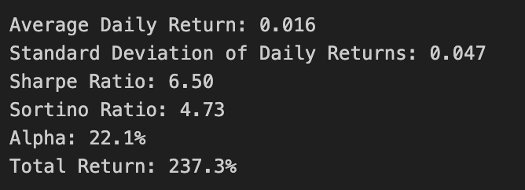

# BTC Deep Learning Weekly Trend Signal
Presentation: https://htmlpreview.github.io/?https://github.com/qboy21/Bitcoin-Deep-Learning-Signal/blob/master/BTC_Signal_FH.html

The Bitcoin Weekly trend signal is derived from on-chain metrics using subscription API endpoints that are updated daily and resampled into a weekly format for feature engineering and analysis.

f1 score weighted for recall of 0.81 and ROC 0.825.

The signal provides a prediction on the direction of Bitcoin's price up (Long) or down (Short) for the upcoming week based on the output from a custom TS-LSTM neural network.

The signal is integrated into a fully automated algorithmic trading system that enters orders based on the signal and 3 other market based conditions on an hourly basis.

Live trading launched in 2023 using a modified Daily Signal that was later changed due to access to API endpoints.

The current model is a Random Forest with 20 features incorporating market, sentiment, on-chain and economic data.

The current Daily Signal Live 3-month performance:

MTD outerperformance v. Bitcoin (+5.6% Pure Alpha) and Total Return (+58.2%).

Code and ATS available upon request.

Copyright 2020, F. Hassan, all rights reserved.
